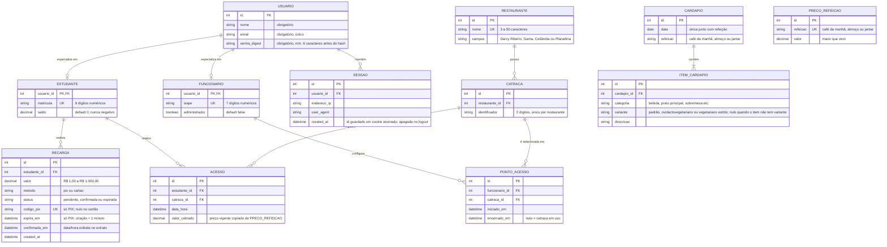

# Modelo ER

```mermaid
erDiagram
    USUARIO ||--o| ESTUDANTE : "especializa em"
    USUARIO ||--o| FUNCIONARIO : "especializa em"
    USUARIO ||--o{ SESSAO : "mantém"

    ESTUDANTE ||--o{ RECARGA : realiza
    ESTUDANTE ||--o{ ACESSO : realiza

    RESTAURANTE ||--o{ CATRACA : possui
    CATRACA     ||--o{ ACESSO : registra
    FUNCIONARIO ||--o{ PONTO_ACESSO : configura
    CATRACA     ||--o{ PONTO_ACESSO : "é selecionada em"

    CARDAPIO ||--|{ ITEM_CARDAPIO : "contém"

    USUARIO {
        int id PK
        string nome "obrigatório"
        string email "obrigatório, único"
        string senha_digest "obrigatório, mín. 6 caracteres antes do hash"
    }

    SESSAO {
        int id PK
        int usuario_id FK
        string endereco_ip
        string user_agent
        datetime created_at "id guardado em cookie assinado; apagada no logout"
    }

    ESTUDANTE {
        int usuario_id PK, FK
        string matricula UK "9 dígitos numéricos"
        decimal saldo "default 0, nunca negativo"
    }

    FUNCIONARIO {
        int usuario_id PK, FK
        string siape UK "7 dígitos numéricos"
        boolean administrador "default false"
    }

    RESTAURANTE {
        int id PK
        string nome UK "3 a 50 caracteres"
        string campus "Darcy Ribeiro, Gama, Ceilândia ou Planaltina"
    }

    CATRACA {
        int id PK
        int restaurante_id FK
        string identificador "2 dígitos, único por restaurante"
    }

    PONTO_ACESSO {
        int id PK
        int funcionario_id FK
        int catraca_id FK
        datetime iniciado_em
        datetime encerrado_em "nulo = catraca em uso"
    }

    ACESSO {
        int id PK
        int estudante_id FK
        int catraca_id FK
        datetime data_hora
        decimal valor_cobrado "preço vigente copiado de PRECO_REFEICAO"
    }

    RECARGA {
        int id PK
        int estudante_id FK
        decimal valor "R$ 1,00 a R$ 1.000,00"
        string metodo "pix ou cartao"
        string status "pendente, confirmada ou expirada"
        string codigo_pix UK "só PIX; nulo no cartão"
        datetime expira_em "só PIX: criação + 1 minuto"
        datetime confirmada_em "data/hora exibida no extrato"
        datetime created_at
    }

    CARDAPIO {
        int id PK
        date data "única junto com refeição"
        string refeicao "café da manhã, almoço ou jantar"
    }

    ITEM_CARDAPIO {
        int id PK
        int cardapio_id FK
        string categoria "bebida, prato principal, sobremesa etc."
        string variante "padrão, ovolactovegetariano ou vegetariano estrito; nulo quando o item não tem variante"
        string descricao
    }

    PRECO_REFEICAO {
        int id PK
        string refeicao UK "café da manhã, almoço ou jantar"
        decimal valor "maior que zero"
    }

```
